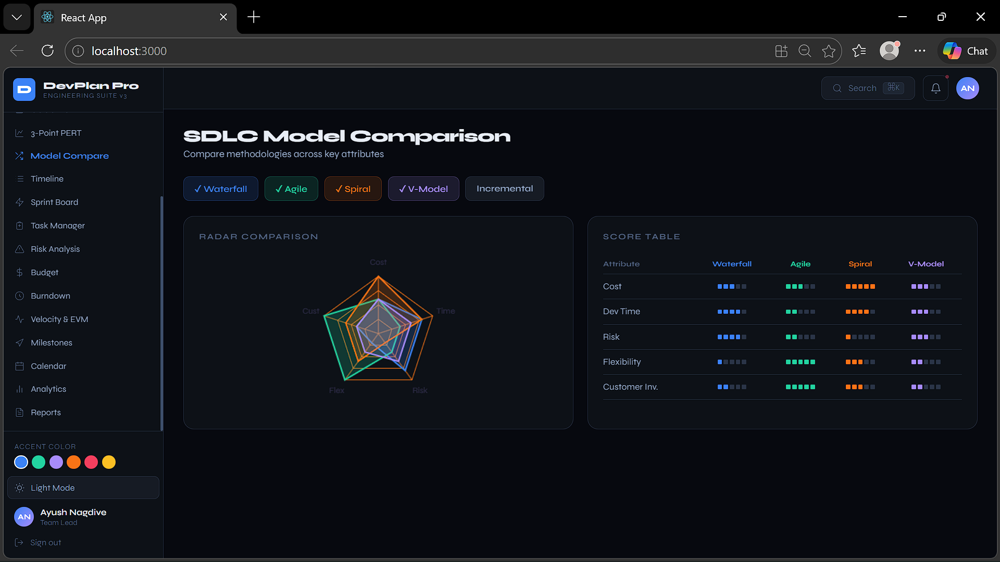
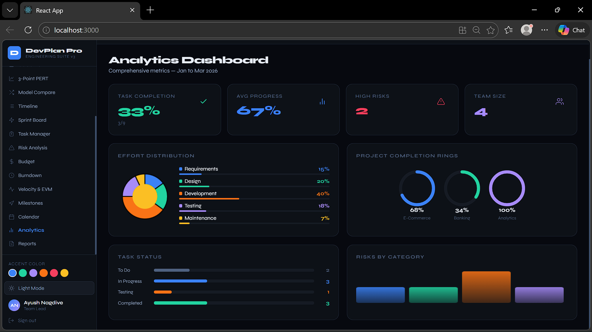
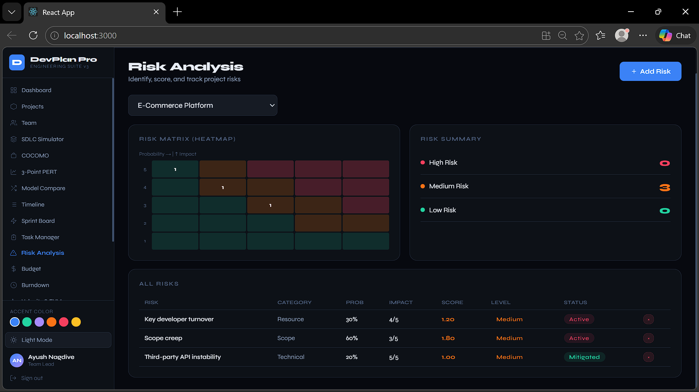
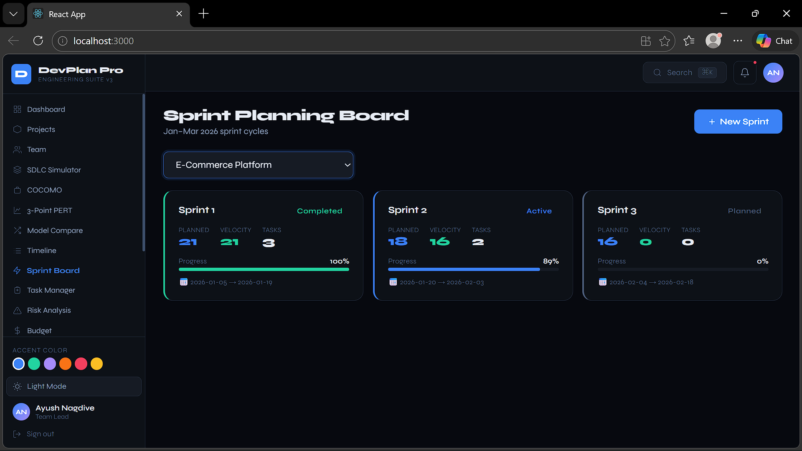
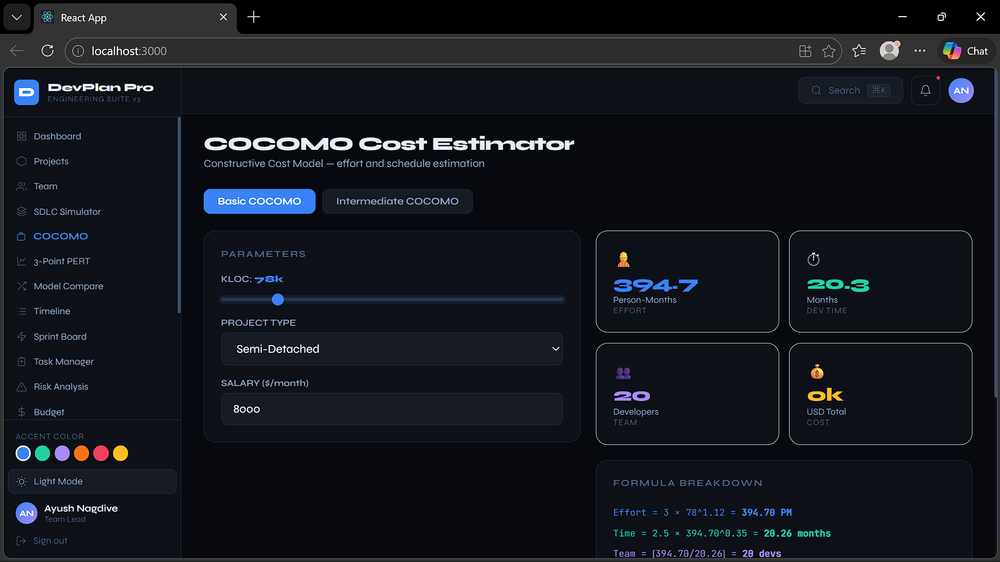
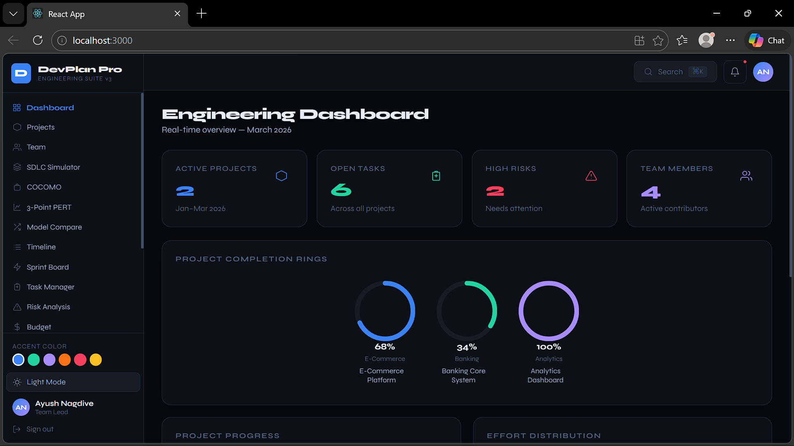

<h1 align="center">🚀 DevPlan Pro</h1>
<h3 align="center">Software Engineering Planning & Simulation Suite</h3>

  <b>Plan smarter. Simulate better. Build efficiently.</b> 
  A modern tool for software project estimation, workflow simulation, and analytics.

  

<h2>📌 Overview</h2>

  <b>DevPlan Pro</b> is a full-stack, browser-based platform designed to simplify 
  <b>software engineering planning and decision-making</b>.

  It integrates powerful industry models like <b>COCOMO I & II</b>, 
  <b>SDLC simulations</b>, and <b>Agile workflow tools</b> into a single, 
  interactive environment — helping developers and teams make data-driven decisions.

<h2>✨ Key Features</h2>

<h3>📊 Project Estimation & Planning</h3>
<ul>
  <li>COCOMO I & II cost estimation models</li>
  <li>Earned Value Management (SPI, CPI, EAC)</li>
  <li>Interactive milestone tracking</li>
</ul>

<h3>🔄 SDLC Simulation Engine</h3>
<ul>
  <li>Waterfall Model</li>
  <li>Agile Model</li>
  <li>Spiral Model</li>
  <li>V-Model</li>
  <li>Incremental Model</li>
</ul>

<h3>📌 Agile Workflow Tools</h3>
<ul>
  <li>Kanban-based Sprint Board</li>
  <li>Burndown Chart visualization</li>
</ul>

<h3>⚠️ Risk Analysis & Insights</h3>
<ul>
  <li>Risk Heatmap (Probability × Impact Matrix)</li>
  <li>Real-time analytics dashboard</li>
</ul>

<h3>🎨 UI/UX Experience</h3>
<ul>
  <li>Aurora WebGL animated background</li>
  <li>Dark/Light theme toggle</li>
  <li>Custom accent color picker</li>
  <li>Global search (Ctrl + K)</li>
</ul>

<h2>📸 Screenshots</h2>

  
  
  

  
  
  

<h2>👥 Team</h2>

<table align="center">
  <tr>
    <th>Name</th>
    <th>Role</th>
  </tr>
  <tr>
    <td><b>Ayush Nagdive</b></td>
    <td>Team Lead & Backend Developer</td>
  </tr>
  <tr>
    <td>Shreya Deshmukh</td>
    <td>Frontend Developer</td>
  </tr>
  <tr>
    <td>Mayur Waghmare</td>
    <td>QA Engineer</td>
  </tr>
  <tr>
    <td>Nikhil Shirbhate</td>
    <td>Business Analyst</td>
  </tr>
</table>

<h2>🛠️ Tech Stack</h2>

<table>
  <tr>
    <th>Category</th>
    <th>Technologies</th>
  </tr>
  <tr>
    <td><b>Frontend</b></td>
    <td>React.js, JavaScript (ES6+), CSS3</td>
  </tr>
  <tr>
    <td><b>Graphics</b></td>
    <td>WebGL2, GLSL</td>
  </tr>
  <tr>
    <td><b>Visualization</b></td>
    <td>Canvas API</td>
  </tr>
</table>

<h2>▶️ Getting Started</h2>

<h3>📋 Prerequisites</h3>
<ul>
  <li>Node.js (v14 or higher)</li>
  <li>npm or yarn</li>
</ul>

<h3>⚙️ Installation</h3>

<pre>
git clone https://github.com/Avio-dels/devplan-pro.git
cd devplan-pro
npm install
npm start
</pre>

<h2>📈 Future Scope</h2>

<ul>
  <li>Backend integration for persistent data storage</li>
  <li>User authentication & role-based access control</li>
  <li>Export reports (PDF / Excel)</li>
  <li>AI-powered cost estimation & recommendations</li>
</ul>

<h2>📚 References</h2>

<ol>
  <li>B. Boehm et al., "COCOMO II Model", IEEE, 2002</li>
  <li>R. Hoda et al., "Agile & Scrum Influence", IEEE, 2019</li>
  <li>Y. Hu et al., "Software Project Risk Management", IEEE, 2013</li>
</ol>

<h2>📜 License</h2>

This project is licensed under the MIT License.

<h2>🤝 Contribution</h2>

  Contributions are welcome. Fork the repository, create a feature branch, 
  and submit a pull request.

  ⭐ If you like this project, consider giving it a star.

